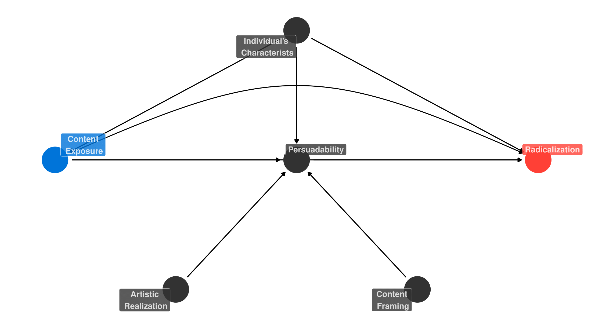

```{r setup, include=FALSE}
options(htmltools.dir.version = FALSE)
pacman::p_load(rtweet, quanteda, text2vec, tidyverse, quanteda.textplots,
               quanteda.textstats, lubridate, ggpubr, quanteda.textmodels,
               seededlda, stm, ldatuning, broom, tidytext, caret, LSX, kableExtra)

df <- readRDS("twitter_df.RDS")
tweets <- select(df, screen_name, text, created_at)

# zmd <- get_timeline("der_zmd", n= 3200)
# alhm <- get_timeline("Alhambra_eV", n= 3200)
# ditib <- get_timeline("DITIBkoln", n=3200)
# igmggenclik <- get_timeline("igmggenclik", n=3200)
# islamratbrd <- get_timeline("Islamratbrd", n=3200)

zmd <- readRDS("zmd")
alhm <- readRDS("alhm")
ditib <- readRDS("ditib")
igmggenclik <- readRDS("igmggenclik")
islamratbrd <- readRDS("islamratbrd")

corp_tweets <- corpus(df)
```
# Content

## 1. Research Interest and Theoretical Framework
## 2. Examples
## 3. Some Early Findings
## 4. Outlook

---
class: inverse, center, middle

# What am I interested in?

---

# Research Interest

## D:Islam Project: Modul 1

> The D:Islam project aims to address the following research questions: Are Muslim communities exposed to Islamist **phishing** and what are the associated strategies?

## The Phishing Analyogy

> [Merriam-Webster](https://www.merriam-webster.com/dictionary/phishing): the practice of tricking Internet users (as through the use of deceptive email messages or websites) into revealing personal or confidential information which can then be used illicitly

--

## Radicalization as Communicative  Persuasion

+ What communicative strategies do Islamists deploy to mobilize consent and membership?
+ More specifically: what narratives and frames?

---
background-image: url("Marten-De-Vos-The-Temptation-of-St-Antony-2-.JPG")
background-size: contain
background-position: 50% 50%
class: inverse, center, top

# Theoretical Framework
<br><br><br><br><br><br><br><br><br><br><br><br><br><br><br><br><br>
The Temptation of St Antony [(Maarten De Vos, 1591)](https://wikioo.org/paintings.php?refarticle=8Y3LQ2&titlepainting=The%20Temptation%20of%20St%20Antony&artistname=Marten%20De%20Vos)
---

# Radicalization as Push and Pull Mechanisms

We can investigate radicalization from the perspective of:

--

+ What pushes people into radicalization?

--
  + [King and Taylor 2011:](https://www.tandfonline.com/doi/full/10.1080/09546553.2011.587064) Effects of group relative deprivation, identity conflicts and personality characteristics
  + [McGilloway, Ghosh, and Bhui 2015:](https://www.tandfonline.com/doi/abs/10.3109/09540261.2014.992008?journalCode=iirp20) Gender and Age
  + [Misiak et al. 2019:](https://www.cambridge.org/core/journals/european-psychiatry/article/systematic-review-on-the-relationship-between-mental-health-radicalization-and-mass-violence/A9E1E9F4409058D5D55ADA5568430AB7) High prevalence of psychotic and/or mood disorders

--

Very potent push factors have proven to be:

--
+ [McCauley and Moskalenko 2008:](https://www.tandfonline.com/doi/full/10.1080/09546550802073367) Personal victimization and political grievance
+ [Emmelkamp et al. 2020:](https://www.sciencedirect.com/science/article/abs/pii/S1359178920301932) Perceived discrimination, perceived group threat, perceived procedural injustice, perceived illegitimacy of authorities

---
# Radicalization as Push and Pull Mechanisms

+ What pulls towards radicalization?

--
  + Appealing societal models, networks, peers etc.
  + **The soft power of communicative persuasion**
--

+ The extremist formula:
  + They utilize grievances in their communication
  + They create intersubjectivity by sharing observations
  + They use codes to trigger tacit knowledge within their audience
  + They superimpose their observations with their ideological frameworks
  + And present a programmatic offer to tackle these political grievances

---
# Radicalization in the Digital Era
--

+ Extremists have moved to the Internet (e.g. [Conversi 2012](https://www.tandfonline.com/doi/full/10.1080/1369183X.2012.698204); [Conway 2017](https://www.tandfonline.com/doi/full/10.1080/1057610X.2016.1157408); [Gill et al. 2017](https://onlinelibrary.wiley.com/doi/full/10.1111/1745-9133.12249); [Macdonald 2016](https://www.tandfonline.com/doi/full/10.1080/1057610X.2016.1157402))
--

+ High Efficacy/Security trade-off [(Morselli, Giguère,and Petit 2007)](https://www.sciencedirect.com/science/article/abs/pii/S0378873306000268) through anonymization and pseudonymization
--

+ Algorithms allow for a slippery slope radicalization
  + Recommender Systems (see [Little and Richards 2021](https://www.mediamatters.org/tiktok/tiktoks-algorithm-leads-users-transphobic-videos-far-right-rabbit-holes))
  + Echo Chambers
  + Diversity of ideas and Dogmatism (see [Hunsberger, Pratt, and Pancer 1994](https://doi.org/10.2307/1386493); [Kruglanski 2014](https://psycnet.apa.org/record/2004-21682-000); [Liht and
Savage 2013](https://doi.org/10.5038/1944-0472.6.4.3); [Saroglou 2002](https://doi.org/10.1080/13674670210144130); [Strozier et al. 2010](https://doi.org/10.1093/acprof:oso/9780195379655.001.0001))
--

+ Artistic underpinnings through pictures, videos, and music (e.g. Anashid, [Pieslak and Lahoud 2020](https://www.tandfonline.com/doi/full/10.1080/1057610X.2018.1457420))
--

+ Volatile target groups because of the digital divide (see [Dimaggio et al. 2004](https://www.scholars.northwestern.edu/en/publications/digital-inequality-from-unequal-access-to-differentiated-use); [Hargittai and Hinnant 2008](https://journals.sagepub.com/doi/10.1177/0093650208321782); [Hargittai and Walejko 2008](https://www.tandfonline.com/doi/full/10.1080/13691180801946150); [Van Deursen and Van Dijk 2014](https://journals.sagepub.com/doi/10.1177/1461444813487959))
--

## TikTok especially powerful!

---
# Suggested Causal Pathways


---

background-image: url("design_hizb.png")
background-size: contain
background-position: 50% 50%
class: inverse, center, top

# Hizb ut-Tahrir

---
class: inverse, center, middle

# Examples

[Generation Islam](https://www.facebook.com/genislam1/)

[Realität Islam](https://www.facebook.com/realitaetislam/)

[Muslim Interaktiv](https://www.tiktok.com/@musliminteraktiv?lang=de-DE)

---

background-image: url("hizbde.png")
background-size: contain
background-position: 50% 50%
class: inverse, center, top

# Examples

---
class: inverse, center, middle

# Some Early Findings

---

# Analytical Strategy So Far

## 1. Identify relevant actors and accounts
## 2. Pull data through APIs
## 3. Apply Computational Text Analysis
###     3.1 Descriptives
###     3.2 Unsupervised Learning
###     3.3 Supervised Learning

---


# Tweets over Time

```{r ts, echo=FALSE, out.width=800}
ts <- tweets
ts$tweet <- 1L

ts <- ts %>%
  mutate(monthly = format_ISO8601(created_at, precision = "ym")) %>%
  mutate(weekly = str_c(
    formatC(isoweek(created_at), format = "f", digits = 0, width = 2, flag = "0"),
    "/",
    str_sub(isoyear(created_at), 3, 4))) %>%
  group_by(screen_name) %>%
  arrange(created_at, .by_group = TRUE) %>%
  mutate("cum" = cumsum(tweet))

ts <- ts %>%
  group_by(screen_name, monthly) %>%
  mutate("month_cum" = cumsum(tweet))

ts <- ts %>%
  group_by(screen_name, weekly) %>%
  mutate("week_cum" = cumsum(tweet))

cum_tweet <- ggplot(ts) +
  geom_line(aes(x=as.Date(created_at), y=cum, color=screen_name)) +
  # geom_point(aes(x=as.Date(created_at), y=week_cum*10, color=screen_name), alpha = 0.1) +
  xlab("Date") +
  ylab("Tweets (cumulative)") +
  scale_x_date(date_labels = "%b %y", date_breaks = "2 month") +
  theme_minimal() +
  theme(axis.text.x = element_text(angle = 90, vjust = 0.5, hjust=1)) +
  labs(color="Account") +
  scale_color_brewer(palette="Dark2")
plotly::ggplotly(cum_tweet)
```

---
# Tweets over Time

```{r ts2, echo=FALSE, message=FALSE, warning=FALSE, out.width=800}
week_tweet <- ggplot(ts) +
  geom_point(aes(x=as.Date(created_at), y=week_cum, color=screen_name), alpha = 0.1) +
  geom_smooth(aes(x=as.Date(created_at), y=week_cum, color=screen_name), se = FALSE) +
  xlab("Date") +
  ylab("Tweets (weekly)") +
  scale_x_date(date_labels = "%b %y", date_breaks = "2 month") +
  theme_minimal() +
  theme(axis.text.x = element_text(angle = 90, vjust = 0.5, hjust=1)) +
  labs(color="Account") +
  scale_color_brewer(palette="Dark2") +
  facet_wrap(~ screen_name)
plotly::ggplotly(week_tweet)
```

---
# Wording

```{r wc1, echo=FALSE, warning=FALSE, message=FALSE, out.width=500, out.height=500, fig.align='center'}
wordclout_1 <- corpus_subset(corp_tweets,
              screen_name %in% c("islam_realitaet", "genislam1", "MInteraktiv")) %>%
  tokens(remove_punct=T,
         remove_numbers = T,
         remove_url = T,
         split_hyphens = T,
         remove_symbols = T) %>%
  tokens_remove(stopwords("english")) %>%
  tokens_remove(stopwords("de", source = "stopwords-iso")) %>%
  dfm() %>%
  dfm_group(groups = screen_name) %>%
  dfm_remove(pattern = c("*.tt", "*.uk", "*.com", "rt", "#*", "@*", ".de")) %>%
  dfm_trim(min_termfreq = 5, verbose = FALSE)

set.seed(100)
wordclout_1 %>%
  textplot_wordcloud(comparison = TRUE, max_words = 100)
```
---

# Wording

```{r wc2, echo=FALSE, warning=FALSE, message=FALSE, out.width=500, out.height=500, fig.align='center'}
two_gram <- corpus_subset(corp_tweets,
                       screen_name %in% c("islam_realitaet", "genislam1", "MInteraktiv")) %>%
  tokens(remove_punct=T,
         remove_numbers = T,
         remove_url = T,
         split_hyphens = T,
         remove_symbols = T) %>%
  tokens_remove(stopwords("english")) %>%
  tokens_remove(stopwords("de", source = "stopwords-iso")) %>%
  tokens_ngrams() %>%
  dfm() %>%
  dfm_group(groups = screen_name) %>%
  dfm_remove(pattern = c("*.tt", "*.uk", "*.com", "rt", "#*", "@*", ".de"))

set.seed(100)
two_gram %>%
  textplot_wordcloud(comparison = FALSE, max_words = 100)
```

---

# Wording

```{r wc3, echo=FALSE, warning=FALSE, message=FALSE, out.width=500, out.height=500, fig.align='center'}
three_gram <- corpus_subset(corp_tweets,
                          screen_name %in% c("islam_realitaet", "genislam1", "MInteraktiv")) %>%
  tokens(remove_punct=T,
         remove_numbers = T,
         remove_url = T,
         split_hyphens = T,
         remove_symbols = T) %>%
  tokens_remove(stopwords("english")) %>%
  tokens_remove(stopwords("de", source = "stopwords-iso")) %>%
  tokens_ngrams(n=3) %>%
  dfm() %>%
  dfm_group(groups = screen_name) %>%
  dfm_remove(pattern = c("*.tt", "*.uk", "*.com", "rt", "#*", "@*", ".de"))

set.seed(100)
three_gram %>%
  textplot_wordcloud(comparison = FALSE, max_words = 100)
```

---
# Keyness

```{r keyness, echo=FALSE, message=FALSE, warning=FALSE, fig.align='center'}
key_df <- bind_rows(filter(df, screen_name=="genislam1"), zmd)

key_corp <- corpus(key_df)

key_dfm <- tokens(key_corp, remove_punct=T,
                  remove_numbers = T,
                  remove_url = T,
                  split_hyphens = T,
                  remove_symbols = T) %>%
  tokens_remove(stopwords("english")) %>%
  tokens_remove(stopwords("de", source = "stopwords-iso")) %>%
  dfm() %>%
  dfm_group(groups = screen_name) %>%
  dfm_remove(pattern = c("*.tt", "*.uk", "*.com", "rt", "#*", "@*", ".de")) %>%
  dfm_trim(max_termfreq = .99,termfreq_type = "quantile",verbose = T) %>%
  dfm_trim(min_termfreq = .7,termfreq_type = "quantile",verbose = T)

result_keyness <- textstat_keyness(key_dfm, target = "genislam1")
textplot_keyness(result_keyness)
```
---

# Unsupervised Learning

```{r stm1, echo=FALSE, warning=FALSE, message=FALSE, fig.align='center'}
arab <- c("ا", "ب", "ت", "ث", "ج", "ح", "خ"
  , "د", "ذ", "ر", "ز", "س", "ش", "ص", "ض", "ط", "ظ", "ع",
  "غ", "ف", "ق", "ك", "ل", "م", "ن", "ه", "و", "ي", "ء")
dfm_post <- corpus_subset(corp_tweets,
                          screen_name %in% c("islam_realitaet", "genislam1", "MInteraktiv")) %>%
  tokens(remove_punct=T,
         remove_numbers = T,
         remove_url = T,
         split_hyphens = T,
         remove_symbols = T) %>%
  tokens_remove(stopwords(source = "smart")) %>%
  tokens_remove(stopwords("german", source = "stopwords-iso")) %>%
  tokens_remove(stopwords("french")) %>%
  tokens_remove(stopwords(language = "ar", source = "stopwords-iso")) %>%
  tokens_select(pattern=arab, selection='remove') %>%
  dfm() %>%
  dfm_remove(pattern = c("*.tt", "*.uk", "*.com", "rt", "#*", "@*", ".de")) %>%
  dfm_trim(max_termfreq = .99,termfreq_type = "quantile",verbose = T) %>%
  dfm_trim(min_termfreq = .7,termfreq_type = "quantile",verbose = T) %>%
  dfm_wordstem()


set.seed(1234)
topic.count <- 10
dfm2stm <- convert(dfm_post, to = "stm")
model.stm <- stm(dfm2stm$documents, dfm2stm$vocab, K = topic.count, data = dfm2stm$meta, init.type = "Spectral", verbose = FALSE)

# plot(model.stm, type = "summary", text.cex = 1)

doc_probs <- tidy(model.stm, matrix = "gamma", document_names = model.stm$meta$title)
terms <- labelTopics(model.stm)
top_terms <- tibble(topic = terms$topicnums,
                    prob = apply(terms$prob, 1, paste, collapse = ", "),
                    frex = apply(terms$frex, 1, paste, collapse = ", "))

gamma_by_topic <- doc_probs %>%
  group_by(topic) %>%
  summarise(gamma = mean(gamma)) %>%
  arrange(desc(gamma)) %>%
  left_join(top_terms, by = "topic") %>%
  mutate(topic = paste0("Topic ", topic),
         topic = reorder(topic, gamma))


gamma_by_topic %>%
  ggplot(aes(topic, gamma, label = frex, fill = topic)) +
  geom_col(show.legend = FALSE) +
  geom_text(hjust = 0, nudge_y = 0.0005, size = 3) +
  coord_flip() +
  scale_y_continuous(expand = c(0, 0), limits = c(0, 0.30), labels = scales::percent) +
  theme_bw() +
  theme(panel.grid.minor = element_blank(),
        panel.grid.major = element_blank()) +
  labs(x = NULL, y = expression(gamma)) +
  scale_fill_brewer(palette="BrBG")
```

---

# Unsupervised Learning

```{r stm3, echo=FALSE, warning=FALSE, message=FALSE, fig.align='center'}
set.seed(100)
plot(model.stm, type = "perspectives", topics = c(4,5))
```

---

# Semi-supervised Learning

```{r dict, echo=FALSE, message=FALSE, warning=FALSE}
dict <- dictionary(list(middle_east = c("israel*", "palest*", "paläs*",
                                        "jerusalem", "aqsa", "*bank", "gaza",
                                        "aparth*", "antisemit*"),
                        muslim_opression  = c("china", "chines*", "uigur*", "uyghur*", "chines*", "camp*", "hindu*", "myanm*", "rohingy*"),
                        resist = c("verteid*", "resist*", "defen*", "widerstand*", "battl*", "wehren*", "abwehr*", "oppos*"),
                        hijab = c("kopftuch*", "scarf*", "niqab*", "jilbab*", "hijab*"),
                        racism = c("rassis*", "race*", "racis*", "black*", "white*", "discrim*", "diskrim*", "nazi*"),
                        islam = c("dua", "quran", "koran", "hadith", "narration", "prophet", "gesandter",
                                   "rasul*", "sahaba*", "salaf", "kalif*", "mubarak", "eid", "deen")))

dict
```

---

# Semi-supervised Learning

```{r seed1m, echo=FALSE, message=FALSE, warning=FALSE}
dfm_seed <- corpus_subset(corp_tweets,
                          screen_name %in% c("islam_realitaet", "genislam1", "MInteraktiv")) %>%
  tokens(remove_punct=T,
         remove_numbers = T,
         remove_url = T,
         split_hyphens = T,
         remove_symbols = T) %>%
  tokens_remove(stopwords(source = "smart")) %>%
  tokens_remove(stopwords("german", source = "stopwords-iso")) %>%
  tokens_remove(stopwords(language = "ar", source = "stopwords-iso")) %>%
  tokens_select(pattern=arab, selection='remove') %>%
  dfm() %>%
  dfm_remove(pattern = c("*.tt", "*.uk", "*.com", "rt", "#*", "@*", ".de", "à", "la")) %>%
  dfm_trim(max_termfreq = .99,termfreq_type = "quantile",verbose = T) %>%
  dfm_trim(min_termfreq = .7,termfreq_type = "quantile",verbose = T) %>%
  dfm_wordstem()


tmod_slda <- textmodel_seededlda(dfm_seed, dictionary = dict)

dfm_seed$topic2 <- topics(tmod_slda)
knitr::kable(table(dfm_seed$topic2), caption = "Sujbect Frequency (Seeds)", col.names = c("Subject (Seed)",
                           "Frequency"))
```


---

# Supervised Learning

```{r bayes_small, echo=FALSE, message=FALSE, warning=FALSE, fig.align='center'}
key_df_small<- key_df
key_df_small<- key_df_small%>%
  dplyr::filter(screen_name %in% c("genislam1", "der_zmd")) %>%
  dplyr::select(text, screen_name)

data_corpus <- corpus(key_df_small, text_field = "text")
# Set a seed for replication purposes
set.seed(68159)

# Generate random 10,000 numbers without replacement
training_id <- sample(1:4666, 2333, replace = FALSE)

# Create docvar with ID
docvars(data_corpus, "id_numeric") <- 1:ndoc(data_corpus)

# Get training set
dfmat_training <-
  corpus_subset(data_corpus, id_numeric %in% training_id) %>%
  dfm(stem = TRUE)

# Get test set (documents not in training_id)
dfmat_test <-
  corpus_subset(data_corpus,!id_numeric %in% training_id) %>%
  dfm(stem = TRUE)

# print(prop.table(table(docvars(
#   dfmat_training, "screen_name"
# ))) * 100)
#
# print(prop.table(table(docvars(
#   dfmat_test, "screen_name"
# ))) * 100)


# Train Naïve Bayes
# The function takes a DFM as the first argument
model.NB <- textmodel_nb(dfmat_training, docvars(dfmat_training, "screen_name"), prior = "docfreq")

# The prior indicates an assumed distribution.
# Here we choose how frequently the categories occur in our data.

dfmat_matched <-
  dfm_match(dfmat_test, features = featnames(dfmat_training))

#summary(model.NB)


#prop.table(table(predict(model.NB) == docvars(dfmat_training, "screen_name"))) * 100
#prop.table(table(sample(predict(model.NB)) == docvars(dfmat_training, "screen_name"))) * 100


actual_class <- docvars(dfmat_matched, "screen_name")
predicted_class <- predict(model.NB, newdata = dfmat_matched)
tab_class <- table(actual_class, predicted_class)
confusion <- confusionMatrix(tab_class, mode = "everything")
confusion
```

---

# Supervised Learning
```{r klein, echo=FALSE, message=FALSE, warning=FALSE, fig.align='center'}

confusion.data <- as.data.frame(confusion[["table"]])

# Reverse the order
level_order_y <-
  factor(confusion.data$actual_class,
         level = c("genislam1", "der_zmd"))

ggplot(confusion.data,
       aes(x = predicted_class, y = level_order_y, fill = Freq)) +
  xlab("Predicted") +
  ylab("Actual") +
  geom_tile() + theme_bw() + coord_equal() +
  scale_fill_distiller(palette = "Blues", direction = 1)
```

---

class: inverse, center, middle

# Can't we talk about grievances anymore?

---


# Word Embeddings - Hizb ut-Tahrir Britain

```{r we1, echo=FALSE, message=FALSE, warning=FALSE, fig.align='center'}
# hizb <- get_timeline("HizbBritain", n=3200)
# saveRDS(hizb, "HizbBritain")
hizb <- readRDS("HizbBritain")
corp_tweets_2 <- corpus(hizb$text)
corp_sent <- corpus_reshape(corp_tweets_2, to =  "documents")

toks_sent <- corp_sent %>%
  tokens(remove_punct=T,
         remove_numbers = T,
         remove_url = T,
         split_hyphens = T,
         remove_symbols = T) %>%
  tokens_remove(stopwords("en", source = "marimo")) %>%
  tokens_remove(stopwords(language = "ar", source = "stopwords-iso")) %>%
  tokens_select(pattern=arab, selection='remove')

dfm_we1 <- toks_sent %>%
  dfm() %>%
  dfm_remove(pattern = "")

# identify context words
tofind <- char_context(toks_sent, pattern = c("*vote*", "*votin*", "*elec*", "*democr*"), p = 0.05, case_insensitive=TRUE)

pales <- char_context(toks_sent, pattern = c("*pales*", "*gaza*", "*israel*", "*bank*"), p = 0.05, case_insensitive=TRUE)

race <- char_context(toks_sent, pattern = c("*discrim*", "*racism*", "*racial*", "*islamoph*", "*hate*", "*black*, *white*", "*nationalis*", "*nazi*", "*facist*", "*ethnic*"), p = 0.05, case_insensitive=TRUE)

democ <- c("#time4khilafah", "#imported_system_not_accepted", "#unificationviakhilafah", "#hiredfacilitators", "#khilafahliberateskashmir", "#ramadhandemandsaction", "#refutewesterncivilization", "system", "faces", "#freenaveedbutt", "policies", "#pakistan", "#hizbbritain", "pakistan", "london")

max_length <- max(c(length(democ), length(pales), length(race)))

hizb_we <- data.frame(Democracy = c(democ,
                            rep(NA, max_length - length(democ))),
                   Palestine = c(pales,
                            rep(NA, max_length - length(pales))),
                   Racism = c(race,
                            rep(NA, max_length - length(race))))

options(knitr.kable.NA = '')

knitr::kable(hizb_we, caption = "Word Embeddings for different Topics") %>%
  scroll_box(width = "750px", height = "500px")

```

---

# Word Embeddings - Linda Sarsour

```{r we2, echo=FALSE, message=FALSE, warning=FALSE, fig.align='center'}
# linda <- get_timeline("lsarsour", n=3200)
# saveRDS(linda, "lsarsour")
linda <- readRDS("lsarsour")
corp_tweets_3 <- corpus(linda$text)
corp_sent_2 <- corpus_reshape(corp_tweets_3, to =  "documents")

toks_sent_2 <- corp_sent_2 %>%
  tokens(remove_punct=T,
         remove_numbers = T,
         remove_url = T,
         split_hyphens = T,
         remove_symbols = T) %>%
  tokens_remove(stopwords("en", source = "marimo")) %>%
  tokens_remove(stopwords(language = "ar", source = "stopwords-iso")) %>%
  tokens_select(pattern=arab, selection='remove')

dfm_we2 <- toks_sent_2 %>%
  dfm() %>%
  dfm_remove(pattern = "")

# identify context words
democ_2 <- char_context(toks_sent_2, pattern = c("*vote*", "*votin*", "*elec*", "*democr*"), p = 0.05, case_insensitive=TRUE)

pales_2 <- char_context(toks_sent_2, pattern = c("*pales*", "*gaza*", "*israel*", "*bank*"), p = 0.05, case_insensitive=TRUE)

race_2 <- char_context(toks_sent_2, pattern = c("*discrim*", "*racism*", "*racial*", "*islamoph*", "*hate*", "*black*, *white*", "*nationalis*", "*nazi*", "*facist*", "*ethnic*"), p = 0.05, case_insensitive=TRUE)

max_length <- max(c(length(democ_2), length(pales_2), length(race_2)))

linda_we <- data.frame(Democracy = c(democ_2,
                            rep(NA, max_length - length(democ_2))),
                   Palestine = c(pales_2,
                            rep(NA, max_length - length(pales_2))),
                   Racism = c(race_2,
                            rep(NA, max_length - length(race_2))))

options(knitr.kable.NA = '')

knitr::kable(linda_we, caption = "Word Embeddings for different Topics") %>%
  scroll_box(width = "750px", height = "500px")

```

---
# Outlook

## 1. Furhter investigate victimization
## 2. Elaborate on local and transnational phenomena
## 3. Apply mixed-methods
## 4. Extend the list of actors and ideologies
## 5. Automate the analysis of contexts
## 6. Further: Extensive TikTok research

---
class: inverse, center, middle
# Thank you very much!
